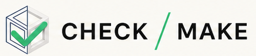

**Let the model explain itself.**

Check Make is a local desktop assistant that analyzes a 3D model before asking the user to describe it. It combines deterministic mesh measurements with optional AI vision to identify likely object types and intended use, expose uncertainty, ask only consequential follow-up questions, and generate a broadly compatible Core 3MF manufacturing package.

Check Make is open-source software. The code is available under the
[MIT license](LICENSE). The project name and visual identity are governed by
the [trademark policy](TRADEMARKS.md), and redistributed research data and
third-party product identifiers are documented in
[third-party notices](THIRD_PARTY_NOTICES.md).

## Desktop workflow

Check Make stays in one continuous model-first workspace. Its process indicator is derived from project state rather than acting as page navigation:

1. **Inspect:** drop or browse to an STL, 3MF, or OBJ model, select the target printer, and run local or optional OpenAI-assisted interpretation.
2. **Prepare:** review the geometry, likely purpose, evidence, uncertainty, material, orientation, and process plan; answer only questions that can materially change the recommendation.
3. **Export:** explicitly accept a ready plan, then create a portable Core 3MF or compatible slicer-native project with validated settings.

Changing the model, printer, or a decision that affects the plan returns the workflow to the appropriate earlier state instead of silently exporting stale recommendations.

## Run locally

Requires Node.js 20+, stable Rust/Cargo, and the Tauri 2 platform prerequisites.

```bash
npm install
npm run tauri dev
```

Both AI connections are optional. A separately started local `llama.cpp` server can produce schema-validated semantic hypotheses without sending the description off-device; see [Local Semantic Interpreter v3](docs/LOCAL_SEMANTIC_INTERPRETER.md). Entering an OpenAI API key enables a Responses API request with mesh measurements and a labelled four-view model montage. Local and cloud Extended AI providers return the same versioned contract and pass through the same confirmation gate. The key is held only in application memory for the current session; it is not saved by Check Make.

## Verify and package

```bash
npm test
npm run build
npm run semantic:acceptance
npm run semantic:providers
cd src-tauri && cargo test
npm run tauri build
```

Official installers are distributed through
[GitHub Releases](https://github.com/Androoz/check-make/releases). Builds,
signatures, installation tests, and live slicer checks are reported as
separate release states; see [the release process](docs/RELEASING.md).

## Release status

- **Published prerelease:** [`v0.2.6-beta.6`](https://github.com/Androoz/check-make/releases/tag/v0.2.6-beta.6) makes the latest responsiveness improvements available to external testers. Beta 4 was consolidated into `main` but was not published.
- **Included:** visible progress during model import, substantially lower analysis allocations, responsive buffered text editing, demand-driven 3D rendering, and reduced preview cost for high-detail meshes. The source-preserving 3MF and multi-plate export boundaries from beta 5 remain authoritative.
- **Automatically verified:** 323 TypeScript tests in 52 files, the production frontend build and bundle budget, 132/132 semantic acceptance checks, deterministic interpretation evaluation, 22 Rust tests, and GitHub CI. Thirteen installed-slicer/profile tests remain environment-dependent and are not counted as passed.
- **Package verification:** the local beta 6 release candidate is checked separately for DMG integrity, signature validity, and executable architectures before the public release is opened to testers.
- **Not established:** clean-machine installation, Intel runtime, installed-slicer round-trips, live providers, physical printing, Developer ID signing, and notarization. Platform-specific GitHub assets are prerelease test builds, not trusted distribution.
- **Evidence boundary:** automated source checks, package creation, architecture inspection, installation/start, Inspect → Prepare → Export, installed-slicer integration, live providers, Intel runtime, and physical printing are recorded independently. Missing or ignored evidence is not counted as passed.

Source validation, building, packaging, signing, installation, launch, core-workflow testing, slicer integration, live-provider testing, physical printing, and publication are independent evidence states. A passed source or CI build does not imply that a package is installable or tested on its target platform.

Maintainers can generate and check the optional physical P1 geometry pilot with `npm run p1:generate` and `npm run p1:verify`; ordinary users are not expected to run it. External observations are cataloged and scope-matched with `npm run evidence:report`; see the [external evidence architecture](docs/EXTERNAL_EVIDENCE_ARCHITECTURE.md) and [generated gap report](docs/EXTERNAL_EVIDENCE_GAP_REPORT.md). See [P1 geometry validation](docs/P1_GEOMETRY_VALIDATION.md) before locking a printer/material scope or recording observations.

Reviewed filament-product data and its native-export boundary are documented in [Filament product profiles](docs/FILAMENT_PRODUCT_PROFILES.md).

## Implemented in 0.2

- one continuous branded **Inspect → Prepare → Export** workspace with state-derived progress, persistent project context, contextual uncertainty, expandable evidence, and gated export
- native application-menu commands for opening and saving `.checkmake` projects with standard macOS shortcuts
- real macOS app-icon packaging plus visible in-app logo
- one native macOS title bar; the duplicate simulated title bar was removed
- native window-level drag-and-drop and file browser import
- STL, 3MF, and OBJ mesh import with normalized local analysis and interactive Three.js preview; original 3MF topology remains the canonical export source instead of being flattened through STL
- save and reopen `.checkmake` project files that preserve the source model, analysis state, printer, answers, and export target
- provider-neutral intelligence contract
- provider-neutral, versioned English semantic hypothesis contract shared by deterministic Local Analysis, optional loopback-only `llama.cpp`, and OpenAI Structured Outputs, including separate printed-object and parent-system understanding
- strict confirmation gate: local-AI confidence cannot activate rules, while grounded explicit statements and user-confirmed facts can enter `ManufacturingIntent`
- optional **Extended AI Analysis** with a local llama.cpp or cloud OpenAI provider selected in Application Settings; cloud credentials remain session-only
- neutral free-text Context input followed by a plain-English **Check Make’s understanding** summary; assumption-led interpretation prefills a reviewable checklist from object purpose, ordinary world knowledge, filename clues, and measured geometry instead of requiring a specific sentence structure
- parent-system context that can interpret descriptions such as “spacer for camping chair” as a spacing component within a portable folding-seat system without inferring that the printed part carries a person; load-critical constraints must be stated explicitly in Context
- a lightweight compositional context graph that combines object roles, activities, and places—for example signage plus disc golf becomes reviewable outdoor course wayfinding—without maintaining a database of complete user phrases
- adaptive structured follow-up questions for consequential gaps; direct Context interpretations and Check Make assumptions are labelled separately, and assumptions affect rules only after review
- geometry-driven support planning in Prepare with two explained choices: follow Check Make or use the opposite support strategy
- a focused Prepare review followed by a Key Settings result view; interpretation, important-area, and support inputs move behind Modify plan after confirmation
- Important areas integrated with Model checks, including visible model overlays and a reset action for spatial selections
- P1 geometry measurements for normalized bed coverage, leverage proxies, centroid offset, and connected overhang regions
- P2 mesh topology findings with separate indexed-source and spatial/coincident-edge measurements, disconnected-part detection, visual geometry-risk overlays, printer-sized build plate, XYZ axes, fixed camera views, and explainable six-orientation comparison
- deterministic rules for material, orientation, compatibility, and process validation
- printer-gated material alternatives integrated into Key Settings → Material, including ten reviewed Prusament and Bambu Lab processing profiles across five material families, explicit trade-offs, capability requirements, and persisted project/export selection
- schema-validated filament-product data with active/stale/retired lifecycle, review deadlines, variant/nozzle scope, native-project identity, reviewed-temperature round-trip checks, and a hard evidence gate that currently prevents every product from making an unqualified performance-upgrade claim
- deferred loading of the interactive 3D preview and model-format loaders, enforced by a gzip-aware production entry-bundle budget
- Core 3MF generation with millimetre units, baked orientation, removal of degenerate triangles, preserved part indices/material assignments, and Check Make analysis metadata
- source-preserving geometry export by default, with optional advanced packaging that can expose disconnected indexed shells as slicer parts without changing mesh coordinates
- explicit build-plate preservation across every export: Bambu Studio, OrcaSlicer, and Creality Print retain one native multi-plate project, while PrusaSlicer, Cura, and generic Core 3MF receive one validated project per imported plate in a manifest-backed ZIP bundle
- an internal Manifold boolean-union capability with bounding-box and watertight-output gates, retained for controlled validation rather than normal user export
- export targets for OrcaSlicer, PrusaSlicer, UltiMaker Cura, and Creality Print, plus installed-slicer detection
- direct Bambu Studio project export using the installed application's machine, process, and filament profiles without launching the slicer
- native OrcaSlicer project export for every printer in the UI, with installed profile resolution and effective-setting validation
- native PrusaSlicer project export for MK4S and CORE One, using the bundled Prusa profiles and effective-setting validation in PrusaSlicer
- native UltiMaker Cura workspace export for ELEGOO Neptune 4 Pro and Creality Ender-3 V3 SE/KE, with installed machine/material/nozzle profiles and embedded-setting validation
- native Creality Print project export for compatible installed profiles, with embedded setting and active-override validation
- deterministic mapping of layer height, walls, shells, infill, support, brim, wall generator/order, seam, and temperatures into Bambu Studio, OrcaSlicer, PrusaSlicer, and Creality Print settings
- active Bambu project-override markers so mapped values survive profile loading instead of reverting to system defaults
- project-structure and setting-level validation before the generated project is saved, plus an integration test of Bambu Studio's effective settings
- post-export reopening with a visible validation report for package structure, geometry, units, placement, provenance, and native settings entries
- direct “Open in Bambu Studio” using a temporary project, alongside permanent “Save project…” export

## Important boundaries

- A mesh does not contain semantics, load direction, environment, or intended use. Check Make may build a conservative world-model hypothesis from Context and geometry, but it labels assumptions separately and requires review before they affect manufacturing rules.
- The designer remains responsible for load cases, dimensions, material qualification, safety factors, and validation. Check Make treats explicit load-critical Context as a preparation requirement and may add rule-backed print margins, but those settings are not structural verification, certification, or proof of fitness for use.
- Interpretation v3.7 uses relation-aware English Context analysis, a four-view montage for cloud analysis, and deterministic mesh measurements while recording status, source, evidence, and confidence per manufacturing requirement. Arbitrary-angle orientation search remains a future analysis milestone.
- Lower cost and Lower weight are temporarily removed. Reliable estimates require complete slicer toolpaths for walls, infill, shells, support, and brim; mesh-volume or bounding-box estimates would imply false precision. OrcaSlicer export remains available, but Check Make no longer launches OrcaSlicer to calculate these alternatives.
- Application Settings can set a default Balanced, Faster, Visual quality, Fit & accuracy, or Structural margin plan preference. Each project can override that default, and Check Make shows deterministic setting changes from the same baseline. A preference is withheld when confirmed requirements make its current rule set unsuitable.
- Lower cost and Lower weight remain unavailable until Check Make has trustworthy toolpath-aware quantity and price inputs. The current plan-preference comparison reports setting changes and qualitative boundaries rather than invented time, mass, or cost deltas.
- Material recommendations and alternatives use one deterministic family-level requirement evaluation for weather, moisture, toughness, heat, flexibility, stiffness, ordinary fatigue/creep direction, and printer capability. A selected active filament-product profile can replace family-level nozzle and build-plate starting temperatures and add product-specific printer checks; stale and retired profiles cannot be newly selected. No current product profile is qualified to claim a structural or service-performance upgrade. Safety-critical fatigue, consequential creep, wear, dishwasher service, and chemical exposure require scoped product/process evidence and block an unqualified export. Alternatives that do not preserve confirmed requirements remain visible but cannot be selected.
- MCP is not a mechanism for a standalone app to reuse a consumer ChatGPT or Claude subscription. Check Make currently supports direct OpenAI API access. A future Check Make MCP server could let ChatGPT or Claude use Check Make as a tool, but that is a different interaction model.
- Generic Core 3MF export makes geometry, units, transforms, and metadata portable, but its process settings remain advisory. The Bambu Studio, OrcaSlicer, PrusaSlicer, UltiMaker Cura, and Creality Print adapters write native project structures and validate mapped settings before saving.
- Native project export depends on the target slicer being installed. Bambu export supports X1 Carbon, P1S, A1, and A1 mini; OrcaSlicer supports all twelve 0.4 mm printer profiles shown in the UI; PrusaSlicer supports MK4S and CORE One; UltiMaker Cura supports ELEGOO Neptune 4 Pro and Creality Ender-3 V3 SE/KE; Creality Print supports the Bambu Lab and Creality profiles available in its installed library.
- Bambu Studio does not expose a single portable `speed preset` setting through this export path, so that recommendation remains advisory and is reported as a warning.
- Explicit source build plates are never inferred or repacked. Check Make locks these projects to Preserve source and imported per-object orientations. Bambu Studio, OrcaSlicer, and Creality Print preserve the native plate graph; PrusaSlicer, Cura, and generic Core 3MF use a deterministic per-plate ZIP bundle because Core 3MF has no interoperable cross-slicer plate-grouping contract. Files without explicit plate metadata remain without Check Make-created plate metadata.
- Normal export never performs implicit geometry repair or boolean union. If Prepare confirms that a model should be one closed solid, manufacturing export is paused until the designer corrects the source in CAD or a dedicated mesh editor and imports the revision. Advanced shell packaging can change 3MF object grouping, but not mesh coordinates. The internal Manifold path remains a controlled validation capability rather than a normal product option.
- STEP/STP import is intentionally deferred because CAD boundary-representation data requires a separately evaluated tessellation engine; it is not treated as a mesh-format variation.

See [P2 model analysis](docs/P2_MODEL_ANALYSIS.md), [the printer support roadmap](docs/ROADMAP.md), [the AI and 3MF architecture](docs/AI_3MF_ARCHITECTURE.md), and [Desktop MVP specification](docs/MVP_SPEC.md).

Manufacturing rules are currently provisional. See the [rule evidence audit and validation plan](docs/RULE_EVIDENCE_AUDIT.md), [P1 geometry validation](docs/P1_GEOMETRY_VALIDATION.md), the [per-rule evidence mapping](rules/rule-evidence.yaml), and the [source catalog](rules/evidence-sources.yaml).

The checked-cube logo, app icon, wordmark, colors, and usage rules are documented in the [visual identity guide](docs/BRAND_GUIDE.md).

## Contributing and support

Contributions are welcome; start with [CONTRIBUTING.md](CONTRIBUTING.md).
Support is best-effort and bounded by [SUPPORT.md](SUPPORT.md). Report
vulnerabilities privately according to [SECURITY.md](SECURITY.md).
